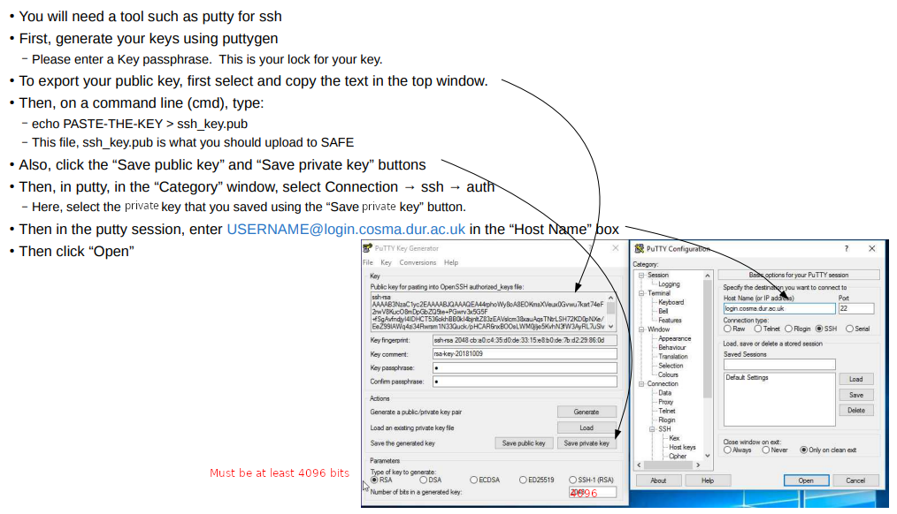

# Getting an account

To get a new COSMA account, you need to apply via the [DiRAC SAFE
system](https://safe.epcc.ed.ac.uk/dirac/)

When creating your account, it is essential that you upload an ssh
key. You should also select the project to which you will belong. This
will either be a DiRAC project, or if you are a local Durham user (for
COSMA5), please select project hpcicc. Once this form has been
submitted, you will then have to wait for COSMA staff to create your
account. You will be notified by email.

Detailed instructions are available below.

You will need an ssh key.

## Generating a SSH key

Authentication requires an SSH key pair. A key pair has two parts:

- A private part (keep this very safe)
- A public part (give this to COSMA/SAFE)

`ssh` uses the public key to generate a "challenge", an encrypted
 message. Only the private key can decode this. Your computer then
 sends the correct response to COSMA, and access is then granted.

On Linux or a Mac you can generate a key pair using:

``ssh-keygen -t ed25519 -C "unique name to identify this key."`` (e.g. ``-C cosmaKey``)

or, if that fails (e.g. if you have an old client)

``ssh-keygen -t rsa -b 4096 -C cosmaKey``

This will ask for a passphrase: PLEASE use a strong one, as the use of
a user with a weak passphrase was responsible for the hacking of HPC
systems across Europe, China and the USA in 2020. Something like 16
characters would be good (perhaps several words strung together).

It will also ask for a location. You can use the default, or something else, e.g. `~/.ssh/id_rsa_cosma`.

This will create:

- id_ed25519 - the private part.  Keep this safe, and consider where it is backed up to (e.g. don't back it up to the "cloud" if the cloud is an untrusted provider or could be hacked), and don't copy it to other systems.  Also NEVER send it by email anywhere.
- id_ed25519.pub - the public part.  Upload this to SAFE.

## SSH from Android

On Android, use e.g. JuiceSSH. You will need to generate a key pair on
the app.

## SSH on Windows

Windows 10 and 11 include the ssh-keygen utility, so keys can be
generated as [here](files/COSMAWindows10sshDocumentation.pdf).  However, if not sing Windows Subsystem for Linux (WSL), a tool such as Putty
will be required.

## Accessing Cosma

First, you need a SAFE account,

- (Service Administration From EPCC)
- Used for all DiRAC facilities.
- In summary: 
 - [https://safe.epcc.ed.ac.uk/dirac/](https://safe.epcc.ed.ac.uk/dirac/)
 - Create an account (institutional email, not personal email)
 - Upload an ssh key
  - Select your project e.g. hpcicc or dpXXX (ask your supervisor)
  - Select COSMA (not COSMOS)
  - Wait...

  - While the account is first authorised...
  - And then created...
  - Finally, you will receive an email!

cosma-support will then add your key to the system (so it might take a
few minutes, depending how busy we are).

To avoid having to enter your passphase every time you ssh to COSMA,
you can use an ssh-agent. e.g. in your local .bashrc file, you can put
something like: `eval $(keychain --eval /path/to/id_rsa 2> /dev/null`)

Note, you can use the same public key on other systems,
e.g. mira.dur.ac.uk, hamilton.dur.ac.uk, github, etc, provided the
private part remains on your system.  Take great care with the private
part.

You will also require a password (in addition to the ssh key passphrase) to log in to COSMA.  This will be provided in your welcome email, and you will be asked to reset it the first time you ssh in.  Note, this means that you will need to enter the temporary password twice (once to log in, and once to being the passwprd reset process), and then enter a new password of your choice twice.  It needs to be at least 10 characters long and contain 3 character classes (lower case, upper case, numeric, special).

If you don't like to enter your password too many tines, you can [set up a ssh control tunnel](ssh.md#reusing-ssh-connections).
