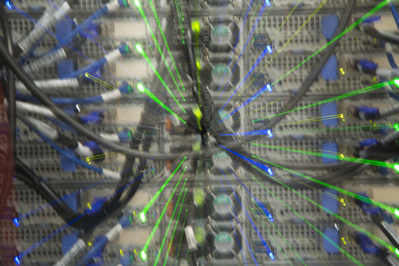

# COSMA

Welcome to the Compute Optimised System for Modelling and Analysis (COSMA), components of which are also known as the COSmology MAchine (COSMA)! Here, you will find some information about the COSMA5, COSMA7 and COSMA8 HPC facilities, and the HPC Hardware Lab.

COSMA is also known as the Compute Optimised System for Memory-intensive Algorithms.

COSMA has been in existence since July 2001 and is now in its 8th generation.

COSMA5 is a Durham system for ICC users and collaborators.

COSMA7 and COSMA8 are the current DiRAC facilities hosted by Durham (COSMA6 was retired in April 2023). COSMA7 was introduced as the DiRAC-2.5x system in May 2018, and expanded by DiRAC-2.5y in January 2019, and as DiRAC-2.5z in April 2019. COSMA8 became operational in October 2020 as the DiRAC-3 prototype system, and was available for a number of months before integration with the full DiRAC-3 system began in April 2021. The full (phase-1) COSMA8 system became operational in September 2021. The COSMA8 phase-2 extension will become operational in July 2023.

The [DINE](facilities.md#dine) experimental system is also part of COSMA.

DiRAC is the UK's integrated supercomputing facility for theoretical modelling and HPC-based research in particle physics, astronomy and cosmology. For more information about DiRAC please visit the [DiRAC web pages](https://www.dirac.ac.uk).

The COSMA systems run security hardened DiRAC Linux.

The login details are:
- cosma5: login.cosma.dur.ac.uk or login5.cosma.dur.ac.uk
- cosma7: login7.cosma.dur.ac.uk (round-robin to login7a, login7b and login7c)
- cosma8: login8.cosma.dur.ac.uk (round-robin to login8a, login8b)

All systems use a global slurm batch system. Submission to any queue (cosma, cosma7, cosma8, etc) can be done from any login node.

COSMA5 is no longer a DiRAC facility. Therefore, DiRAC users should use COSMA7 or 8 as appropriate for their project.

## Scheduled downtime

COSMA has 3 periods of scheduled downtime per year, lasting up to a week, though typically the affected period is much shorter. These are typically during the first full weeks of February, June and October (every 4 months).

