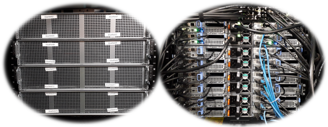
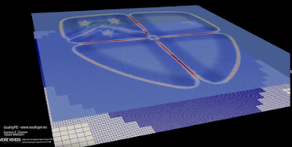
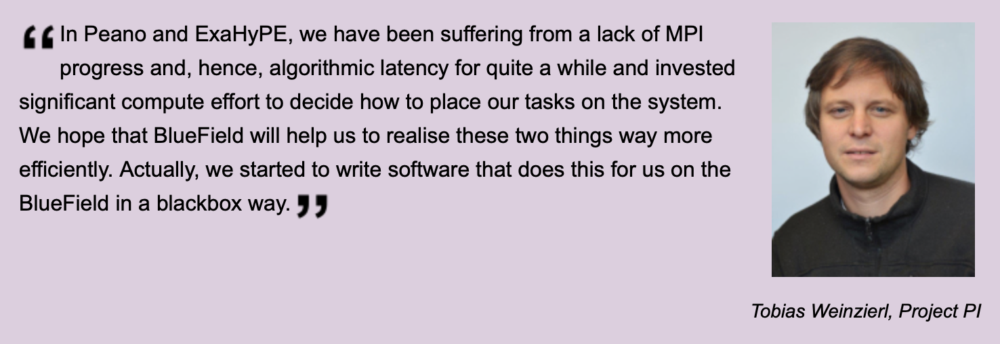

# COSMA Facilities


COSMA is comprised of:

- [COSMA5](facilities.md#cosma5),
- [COSMA7](facilities.md#cosma7),
- [COSMA8](facilities.md#cosma8),
- Storage and support hardware (including tape drives for archival).

COSMA also includes a number of other facilities including:

- the DINE BlueField cluster
- the Cosmological Database
- GPU systems
- Other facilities

Storage includes:

- /cosma5 - 2.4PB
- /cosma6 - 2.5PB (to be retired in Autumn 2023)
- /cosma7 - 3.1PB
- /cosma8 - 5.3PB
- /snap7 - 440TB for fast temporary storage (e.g. checkpointing)
- /snap8 - 1.2PB for fast temporary storage (e.g. checkpointing)
- /cosma/home - 37TB for user homespace (10GB quota)
- /cosma/local - 37TB for program/module storage

Users have access to /cosma/home/PROJECT/USERNAME, and one or more of /cosmaN/data/PROJECT/USERNAME.

## COSMA5

COSMA5 has approximately 300 compute nodes, each with 128GB RAM and 16 cores (2x Intel Xeon CPU E5-2670 0 @ 2.60GHz). These have a Sandy Bridge architecture.

The nodes are connected via Mellanox FDR10 Infiniband switches in a 2:1 blocking configuration. Access is enabled through two login/development servers each with 512GB of memory. Previously, there was a 2.5PB GPFS file system (DDN ExaScalar). However in early 2020, this was replaced by a 650TB Lustre system (Dell), later updated to 1.6PB, replacing 2.5 racks of equipment drawing 26kW with 1/6th of a rack drawing 1.5kW.

## COSMA6


COSMA 6 has now reached end of life and was retired in April 2023, after 11 years of operation (first at Daresbury, then as part of COSMA). It had about 600 compute nodes, each with 128GB RAM and 16 cores (2x Intel Xeon CPU E5-2670 0 @ 2.60GHz). COSMA6 therefore included about 10,000 compute cores, based on the Sandy Bridge architecture.

The nodes were connected via Mellanox FDR10 Infiniband switches in a 2:1 blocking configuration. Access was enabled through a login/development server with 512GB of memory. A Lustre storage system configured with 2.6 PB of data space was available.

## COSMA7


COSMA 7 has 448 compute nodes, each with 512GB RAM and 28 cores (2x Intel Xeon Gold 5120 CPU @ 2.20GHz) giving it 12544 cores. The CPU is based on the skylake architecture.

A single job can only span half of COSMA7. This is because one have uses a Mellanox EDR InfiniBand fabric, while the other half (224 nodes) uses a Rockport switchless Ethernet fabric.

You should use the cosma7 partition for InfiniBand, and cosma7-rp for Rockport.

The Rockport fabric forms a 6D torus. The InfiniBand fabric has a fat tree topology with a 2:1 blocking configuration.

Access is enabled through three login/development servers each with 1.5TB of memory. Currently connected is a DELL storage system configured with 3.1 PB of data space (/cosma7), and a fast I/O storage with 459TB (/snap7) for temporary checkpointing. Both file systems are based on Lustre.

## COSMA8

The COSMA8 prototype system entered service in October 2020. It was then extended in early 2021, to become the initial COSMA8 installation. This is undergoing science commissioning until October 2021, when it will enter full service. It is the first COSMA system to reach Petascale, with 1.37PF achieved on the HPL benchmark (RMax), and a 1.9PF peak performance. Each node has 4.2 TFLOP HPL performance.

It is currently comprised of:

- 360 compute nodes with 1 TB RAM and dual 64-core AMD EPYC 7H12 water-cooled processors at 2.6GHz
  - To be upgraded with an additional 168 nodes with dual Milan 7763 processors at 2.45GHz
- 2 login nodes with 2 TB RAM and dual 32-core AMD EPYC 7542 processors at 2.9GHz
- 2 fat nodes with 4 TB RAM and dual 64-core AMD EPYC 7702 processors at 2.2GHz
- 1 AMD GPU nodes with 6 MI50 GPUs (32GB), 1TB RAM, dual 16-core AMD EPYC 7282 processors at 2.8GHz
- 1 AMD Milan node with a MI100 GPU, 1TB RAM, dual 64-core AMD EPYC Milan 7713 processors at 2GHz
- 2 AMD Milan nodes with 2x MI200 GPUs each, 1TB RAM, dual 64-core processors
- 1 NVIDIA GPU node with 10 V100 GPUs (32GB), 768GB RAM, dual Intel Xeon Gold 5218 processors at 2.3GHz
- 2 console nodes with a single 16-core AMD EPYC 7302 processor at 3GHz and 256GB RAM

The interconnect is Mellanox HDR, 200GBit/s, with a non-blocking fat tree topology.

The full initial COSMA8 system is due to enter service in October 2021.

Information about using COSMA8 can be found [here](cosma8.md).

The list of people who helped assemble COSMA8 can be found [here](facilities.md#cosma8-builders)

### COSMA8 builders

The following people helped build COSMA8:

Yannick Bahe

Alastair Basden

Elijah Basden

Miriam Basden

Peter Draper

Aqeeb Hussain

Yuankang Liu

Fawada Qaiser

Richard Regan

Paul Walker

(if you are not on this list but should be, please let us know, apologies!)

## DINE

The Durham Intelligent NIC Environment (DINE) supercomputer is a small 24-node development cluster equipped with NVIDIA BlueField-2 Data Processing Units (DPUs) using a non-blocking HDR200 fabric. These DPUs enable direct access to remote memory to improve the performance of massively parallel codes, in preparation for future exascale systems, and will provide researchers with a test-bed facility development of new and novel computing paradigms.

The cost of data movement - both runtime and energy - is predicted to be one major showstopper on our road to exascale. As computers driving data centres, supercomputers and machine learning farms become faster, their interconnects, i.e. communication devices, grow into a limiting factor; even worse, they also face the omnipresent unreliability that will arise. One way to improve them is to make them smart – to make them learn how to route data flows, how to meet security constraints, or even to deploy computations into the network. Smart network devices can take ownership of the data movement, bring data into the right format before it is delivered, care about security and resiliency, and so forth.

DINE has been funded by DiRAC, ExCALIBUR, the Department of Computer Science and the Institute for Computational Cosmology as part of a strategic research equipment purchase.


### Using DINE

Please see [DINE]() notes for information about using DINE.

#### DINE notes

__Using BlueField__

A DPU hackathon was held in February 2023, which included many useful tips on how to use DINE. A presentation is available from cosma-support which provides usage examples, namely the lab exercises on slides 45 and 84. Please request UK_DPU_Hackathon.pptx

__Network information__

DINE has several networks:

__Command and control network__

Used for login, SLURM submission, etc. Both the hosts and BlueField cards are connected to this network. You can specify as:

b[101-124] for the hosts, and

bluefield[101-124] for the cards

This network is accessible from the login nodes.

__InfiniBand network__

The high performance (200GBit/s HDR) fabric used for inter-job communication and some file system access. Both the hosts and BlueField cards are connected to this network. You can specify as:

bfd[101-124].ib for the hosts

bfh[101-124].ib for the cards

This fabric is not accessible from the login nodes: it is only accessible to other DINE nodes (hosts and BlueField cards).

__Local BlueField card access__

From a host, bfl will provide access to the attached card over a slow internal network.

__SLURM submission__

To submit to DINE, you need to belong to the "durham", "do008" or "do009" group, and submit such as:

    #SBATCH -p bluefield1

    #SBATCH -A durham

    or

    #SBATCH -A do008

    etc

__SLURM submission to both host (x86) and BlueField device (ARM) cores__

To submit a job that will run across both host and arm cores, the following procedure can be used (Mark Turner).

A SLURM script such as:

    #!/bin/bash -l
    #SBATCH -o smartmpi.out
    #SBATCH -e smartmpi.err
    #SBATCH -p bluefield1
    #SBATCH -A durham
    #SBATCH -t 00:30:00
    #SBATCH --nodes=2

    module purge
    module load python/3.6.5

    # Get a comma separated list of IPs for the host and
    # Smart NICs that SLURM has assigned us
    IPs=$( python3 smartmpi/scripts/dine_config.py )
    echo "IPs in use: " $IPs

    # Assumes alternating topology with 2 ranks per node
    # (one on x86; one on arm64)
    np=$(( $SLURM_JOB_NUM_NODES * 2 ))
    echo "Num processes: " $np

    # Prevent SLURM from blocking the use of Smart NICs
    unset SLURM_JOBID

    mpirun --mca btl_tcp_if_exclude tmfifo_net0,lo,em1 -host $IPs -np $np launcher_script.sh

Where the dine_config.py file is defined as:

    import os

    def extract_nodes(nodes):
    for node_entry in nodes.split(','):
    elem = node_entry.split('-')
    if len(elem) == 1:
    yield int(elem[0])
    elif len(elem) == 2:
    node_range = list(map(int, elem))
    for i in range(node_range[0], node_range[1]+1):
    yield i
    else:
    raise ValueError('format error in %s' % x)

    def print_ips(node_list):
    node_ips = []
    for node in extract_nodes(node_list):
    basenumber = 200
    ip_elem = node - basenumber
    node_ips.append(f"172.18.178.{2*ip_elem-1}")
    node_ips.append(f"172.18.101.{2*ip_elem}")
    print(",".join(node_ips))


    """
    This script is intended for use on the DINE cluster. It should be used within SLURM
    jobs before the mpirun command.

    It prints the comma separated IPs for the x86 hosts and arm 64 Smart NICs allocated
    to us by SLURM. In SLURM I capture this stdout within a variable and pass it to
    the `-host` argument to mpirun when not using a rankfile.

    For full documentation on smarTeaMPI on DINE, see docs/.
    """
    if __name__ == "__main__":
    node_list = os.environ["SLURM_JOB_NODELIST"]
    print_ips(node_list[2:-1])

And the launcher script is (assuming paeno is the code to be run):

    #!/bin/bash -l

    case "$HOSTNAME" in
    "bluefield"* )
    export OMP_NUM_THREADS=16
    ./Peano_bfd/examples/exahype2/euler/peano4 --timeout 300
    ;;
    "b1"* )
    export OMP_NUM_THREADS=32
    ./Peano/examples/exahype2/euler/peano4 --timeout 300
    ;;
    esac

These scripts can be found in /cosma/home/sample-user/dine/

__Intel MKL__

DINE is an AMD system, and Intel MKL is known to be hobbled. There are some [work arounds](cosma8.md#using-mkl-with-cosma8) to improve performance.

__Intel Compiler__

If you compile with -xHost, you may get:

```Please verify that both the operating system and the processor support Intel(R) X87, CMOV, MMX, FXSAVE, SSE, SSE2, SSE3, SSSE3, SSE4_1, SSE4_2, POPCNT and AVX instructions.```

### The system

The Durham Intelligent NIC Environment (DINE) supercomputing facility is hosted alongside by COSMA, and is used by Computer Science researchers, DiRAC researchers and international collaborators.


A key feature of DINE is the NVIDIA [BlueField](https://www.nvidia.com/en-us/networking/products/data-processing-unit/) smart NIC cards which provide a programmable network offload capability, allowing network functions to be accelerated, and freeing up compute cores for other tasks.

DINE is comprised of 24 nodes each containing:

- Dual 16-core AMD EPYC 7302 ROME processors (3GHz)
- 512GB RAM
- BlueField-2 Smart NIC (200 GBit/s HDR200)
- These contain 16GB RAM, 8 high clock ARM cores and Ubuntu 20.04
- NVIDIA HDR200 InfiniBand switch

Students will also benefit from working with cutting-edge technologies, designing algorithms and investigating ideas which will carried forward into future UK and international facilities.



### Access

Access is available free of charge to the UK research community. High priority will be given to developmental and fundamental Exascale research (no production runs).

Students will also be given access and hence benefit from working with cutting-edge technologies. This will help them to design algorithms and investigate ideas which will carried forward into future UK and international facilities.

We are willing to give collaborators and external scientists access to the system as well to allow them to prototype novel algorithms and write new software using smart network devices.

To get access, please follow [these instructions](account.rst) to apply for an account, signing up to project do009, and then send a message to cosma-support@durham.ac.uk mentioning your interest in BlueField.

COSMA8 login nodes should be used for compiling code (also AMD Rome processors). Where native ARM access is required, please create a Slurm job to run on the partition (bluefield1), and then ssh directly to the local BlueField card.

The [SLURM workload manager](slurm.md) should then be used to submit jobs to the other nodes, using the bluefield1 queue.

If should be noted that DINE has automatic powersaving features - unused nodes will be powered off after 1 our. When a Slurm job is submitted, these nodes will be powered on if necessary, which can take a few minutes.

### Hints and tips for usage

The Ethernet network (control, ssh, slurm) has:

Hostnodes, b[101-124]: 172.17.178.[201-224]

BlueField cards, bluefield[101-124]: 172.17.179.[201-224]

InfiniBand is reached via:

bfh[101-124]: 172.18.178.[201-224] for the hosts

bfd[101-124]: 172.18.179.[201-224] for the BlueField cards

The BlueField cards (devices) operate in "Host Separated" mode, meaning that they can be treated as servers in their own right (running Ubuntu), and MPI jobs can run on both host and device.

Currently, manual mpirun calls are necessary to specify the hosts and devices to use.

If you have any hints that you would like to appear here, please let us know!

### Associated Projects



[http://www.peano-framework.org/index.php/projects/exaclaw-clawpack-enabled-exahype-for-heterogeneous-hardware/](http://www.peano-framework.org/index.php/projects/exaclaw-clawpack-enabled-exahype-for-heterogeneous-hardware/)

Durham project funded by EPSRC under the ExCALIBUR programme.


[www.exahype.org](www.exahype.org)

EU H2020 FET HPC project with partners from Munich (Technische Universitat Munchen and Ludwig-Maximilians Universitat), Trento and Frankfurt.



### Relevant links

- Durham's [Master in Scientific Computing and Data Analysis](https://miscada.webspace.durham.ac.uk) hosts several modules discussing aspects of novel HPC.
- The [Department of Computer Science](https://www.dur.ac.uk/departments/academic/computer-science/) formally sponsors/purchases this tool.
- [Durham's Student Cluster Competition](https://scicomp.webspace.durham.ac.uk/clusdur) team.
- The [teaMPI software](https://tobiasweinzierl.webspace.durham.ac.uk/software/peano/teampi/) is one of the first tools tailored towards SmartNICs.

Let us know if you want to be added.

### Publications

- Philipp Samfass et al write on [Lightweight Task Offloading Exploiting MPI Wait Times for Parallel Adaptive Mesh Refinement](https://arxiv.org/abs/1909.06096). This task offloading mechanism is something we port to SmartNICs.
- Dominic E. Charrier et al write on [Enclave Tasking for Discontinuous Galerkin Methods on Dynamically Adaptive Meshes](https://arxiv.org/abs/1806.07984), a technique that yields many tiny tasks. Implementation challenges (incl MPI progression) are sketched and the need for smart network devices is highlighted.
- Follow Philipp Samfass et al it ISC 2020 (online presentation will become available later) when we present our work on [TeaMPI—Replication-based Resilience without the (Performance) Pain](https://2020.isc-program.com/presentation/?id=pap117&sess=sess318).

### Acknowledgement

This work has used Durham University's DINE cluster. DINE has been purchased through Durham University’s Research Capital Equipment Fund 19_20 Allocation, led by the Department of Computer Science. It is installed in collaboration and as addendum to DiRAC@Durham facility managed by the Institute for Computational Cosmology on behalf of the STFC DiRAC HPC Facility ([www.dirac.ac.uk](www.dirac.ac.uk)). DiRAC equipment was funded by BEIS capital funding via STFC capital grants ST/P002293/1, ST/R002371/1 and ST/S002502/1, Durham University and STFC operations grant ST/R000832/1. DiRAC is part of the National e-Infrastructure.

## The Cosmological Database

The Cosmological Database is a collection of database-stored cosmological information, accessible through different mediums.

This includes:

[the Virgo Database](https://virgodb.dur.ac.uk)

There will also shortly be a SciServer instance available for testing

## Rockport cluster

The Rockport cluster uses half of COSMA7, replacing the InfiniBand network with a switchless Rockport Ethernet network, based on a 6D torus topology.

Each node has 28 cores and 512GB RAM, and has the /cosma7 storage (3.1PB attached)

For usage information please see [here](rockport.md).

## Other facilities

Other facilities available to COSMA users (depending on membership of certain projects, please ask if you're uncertain!) include:

- mad01 - a 3TB system with 56 cores
- cosma7-shm queue: mad02, 1.5TB with 112 cores
- cosma7-shm2 queue: mad03, 6TB with 48 cores
- cosma8-shm queue: mad04, mad05, each with 4TB with 128 cores
- cosma8-shm2 queue: ga004, 1TB with 128 cores and MI100 GPU


