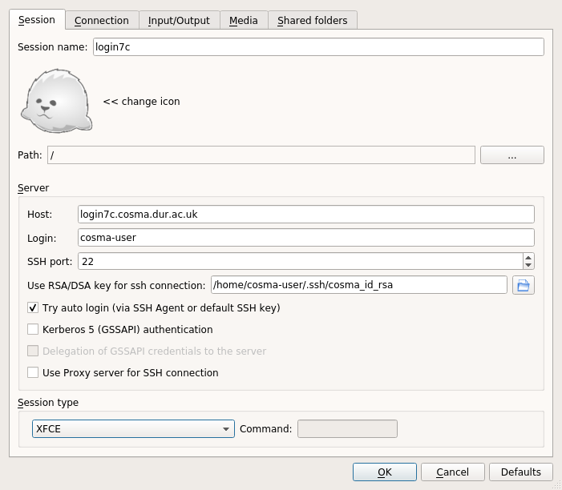

# Graphical Access

## Graphical Desktops

COSMA offers 2 ways to get a graphical desktop, in addition to standard X-11 forwarding: x2go and vnc. x2go is probably simpler to set up.

## X2go

You will need an [x2go](https://wiki.x2go.org/doku.php) client on your desktop/laptop. This is available under common package repositories.

Launch the client (e.g. x2goclient on Linux).

Create a new session with the following details:

Session name: (e.g. cosma - choose a name that means something to you!)

Host: Choose a cosma login node (e.g. login5a.cosma.dur.ac.uk)

Login: Your cosma user name

Use your ssh key for ssh connection: Select your private ssh key.

Session type: Select Xfce. You may need to untick the "Try auto login" box, but if it works with it ticked, that is probably more convenient.

Save these settings. Then, click on this entry, and eventually, you will be given a graphical desktop environment on COSMA. You may need to enter your ssh key, then your password, and finally your ssh key again.

Also note, if you have an error in your .bashrc file (for example, trying to load a non-existant module), then the x2go login may fail. To solve this, remove the offending lines from your .bashrc file.

## VNC

While VNC can be used, ssh is preferred.

However, to use vnc, the following steps can be taken:

On a login node:

    vncserver :N 

(where N is a number from 1 to something - try starting with 1)

If you haven't set up a vnc password run:

    vncpasswd

From your laptop/desktop:

    ssh -Nf -L 5900:LOGINNODE:5900+N USERNAME@LOGINNODE.cosma.dur.ac.uk

And then:

    vncviewer localhost:5900
e.g.

On login7a:

    vncserver :2

On laptop:

    ssh -Nf -L 5900:login7a:5902 dc-user1@login7a.cosma.dur.ac.uk

    vncviewer localhost:5900

